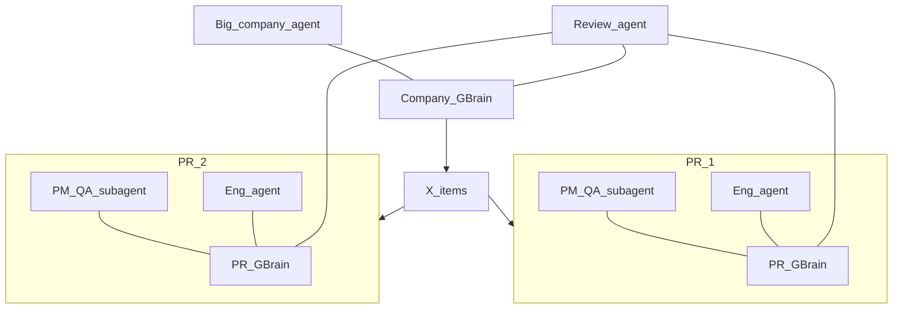

# Feedback → Feature Factory

Google reviews drive a software factory: pick features and bug fixes, PM/QA subagents spec each one, engineering opens PRs, a company-brain reviewer checks them, a human merges to main.

## Pipeline


1. **Google reviews → decide** — Company agent reads reviews (API and/or browser), clusters pain into **X features or bug fixes**, ranked with quotes as evidence. Writes themes into the **company GBrain**.
2. **Per-feature PM/QA subagent** — For each item, a subagent acts like a PM/QA: mockup / acceptance criteria / what to fix or add **and why** (tied to review quotes + company constraints). Writes into that item’s **PR GBrain**.
3. **Engineering agent** — Implements from the PM/QA spec and opens a **PR** (Superset).
4. **Code review agent** — Reviews the PR with access to the **company GBrain** (full product knowledge) plus that PR’s GBrain (spec, decisions, review evidence).
5. **Human merge** — Only a real human merges to `main`. Agents never auto-merge.

## Memory model

| Brain | Scope | Holds | Who uses it |
| --- | --- | --- | --- |
| **Company GBrain** | Whole business | Product docs, brand, past decisions, all review themes, shipping norms | **One big company agent**; review agent; any agent that needs “everything about the business” |
| **PR GBrain** | One feature / one PR | That item’s reviews evidence, PM/QA mockup & why, eng notes, review comments | Feature subagents for that PR only |



- **Big agent** = single brain of the business (company GBrain). Decides what to build from Google reviews; answers cross-cutting questions; company-aware code review draws on it.
- **Smaller GBrain per PR** = isolation so feature work stays scoped; PM/QA and eng for that PR don’t pollute (or get polluted by) other PRs’ drafts.
- PR brains can **ask up** to the company agent / company GBrain when they need global context (“does dark mode conflict with brand?”).

## Sponsor map

| Sponsor | Role |
| --- | --- |
| **UFO** | Business agent OS — home of the **big company agent**; founder/PM chat; kick off “read reviews → ship X”; human sees review verdicts before merge |
| **QM** | Multiplayer harness — scopes for discovery, per-feature PM/QA subagents, review agent |
| **GBrain** | Company brain + one brain per PR (slug/source prefixes or bound scopes) |
| **Memorable** | Procedural memory — how we scrape/cluster reviews, how we write a PM spec, how we open a PR |
| **Superset** | Engineering agents — implement + open PRs in worktrees |
| **River** | Train the company/orchestrator agent on this business’s docs + accepted specs so review→feature taste is owned |

## Demo surface

**AcmePulse** — fake SaaS with intentional gaps that Google-style reviews complain about.

**Reviews** — real Google reviews for a similar public product (and/or Places API), plus fixtures so the demo still runs if scrape fails. Live path is first-class: reviews in → X items out.

## Agent jobs

| Agent | Knows | Does |
| --- | --- | --- |
| **Company agent** (big) | Company GBrain (+ River model) | Ingest Google reviews; choose X features/bugs; answer business questions; hand work to subagents |
| **PM/QA subagent** (per item) | PR GBrain; can query company GBrain | Mockup / AC / “what + why” from review evidence |
| **Engineering agent** | PR GBrain spec + repo | Implement; open PR |
| **Review agent** | Company GBrain + that PR GBrain | Code review against product truth and the PM/QA why |
| **Human** | GitHub | Merge to `main` only |

## What this repo actually is

**Not** mostly “Python that calls Superset.”

| Layer | What it is | Approx. share of work |
| --- | --- | --- |
| **`apps/acmepulse`** | Fake SaaS the factory ships into (UI + intentional bugs) | Product demo surface |
| **`factory/`** | Thin Python glue: fetch Google reviews, cluster, write GBrain, kick pipeline stages | Small — orchestration, not the brains |
| **`agents/`** | Prompts, skills, UFO/QM agent configs — company agent, PM/QA, review | Most of the “intelligence” behavior |
| **`memory/`** | Seed content for company GBrain + templates for per-PR brains | Docs the big agent knows |
| **CLIs you drive** | `gbrain`, `memorable`, `ufo` / `ufoctl`, `qm`, `superset` CLI/MCP/SDK, River API | Sponsors do the heavy lifting |

**Eng step:** company/PM agents (or a small Python step) spawn work via **Superset CLI / MCP / SDK** (`superset new "…"`, or `agents_create`) against `apps/acmepulse` — they do not reimplement coding agents in Python.

```text
factory (thin)     →  reviews in, GBrain writes, “start eng”
UFO / QM agents    →  decide X, PM/QA specs, review
Superset           →  implement + open PR
Human              →  merge main
```

## Folder structure

```text
intel/
├── ARCHITECTURE.md
├── README.md
├── apps/
│   └── acmepulse/                 # fake SaaS (Next.js or similar)
│       ├── app/                   # intentional gaps reviews complain about
│       ├── package.json
│       └── ...
├── factory/                       # thin Python orchestration
│   ├── pyproject.toml
│   ├── explore.py                 # Google reviews ingest (API + fixture fallback)
│   ├── cluster.py                 # themes → candidate features/bugs
│   ├── gbrain_sync.py             # write company / PR brain notes
│   ├── pipeline.py                # stage runner: decide → pm → eng → review
│   ├── superset_spawn.py          # CLI/SDK: open workspace + coding agent
│   └── fixtures/
│       └── reviews.json           # demo-safe review corpus
├── agents/                        # agent definitions (not heavy app code)
│   ├── company/                   # big agent — full company GBrain
│   │   ├── SYSTEM.md
│   │   └── skills/
│   ├── pm_qa/                     # per-feature subagent
│   │   └── SYSTEM.md
│   ├── review/                    # company-aware code review
│   │   └── SYSTEM.md
│   └── ufo/                       # UFO pack/extension or prompt wiring
│       └── ...
├── memory/
│   ├── company/                   # seed notes → company GBrain
│   │   ├── product.md
│   │   ├── brand.md
│   │   ├── decisions.md
│   │   └── reviews/               # ingested themes land here conceptually
│   └── pr/                        # template for per-PR GBrain slug
│       └── TEMPLATE.md
├── river/                         # optional train set for orchestrator taste
│   ├── dataset.jsonl
│   └── train_notes.md
└── demo/
    ├── SCRIPT.md                  # live demo beats
    └── screenshots/
```

**GBrain layout (logical, inside GBrain — not necessarily all files on disk):**

```text
company/                 # big brain
  product, brand, decisions, review-themes
pr/<feature-id>/         # small brain per PR
  evidence, pm-spec, mockup, eng-notes, review
```

## Pitch (30s)

“Google reviews decide what to build. A company agent with a full **GBrain** picks X fixes. Each gets a PM/QA subagent and its own PR brain, Superset ships the PR, a reviewer with the company brain checks it, and a human merges. We don’t rent intelligence—we own the business memory and the factory.”
