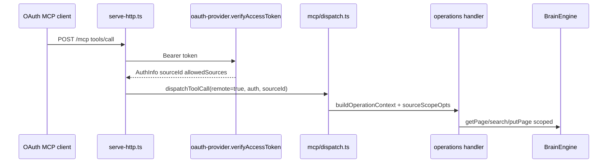

# GBrain source audit — seam map (Harmony W00)

**Checkout:** `/workspace/harmony-workspace/gbrain`  
**Branch:** `harmony/main` (tracking upstream `master`)  
**Recorded SHA:** `e78f1c38b947b053f3a46881340f74f316be855a`  
**Tagged release line:** v0.59.0.0 (`package.json`)

Handoff references: [04-upstream-forks-and-integration.md](../../harmony-engineering-handoff/04-upstream-forks-and-integration.md), [09-gbrain-knowledge-and-provenance.md](../../harmony-engineering-handoff/09-gbrain-knowledge-and-provenance.md), [15-implementation-backlog-and-runbook.md](../../harmony-engineering-handoff/15-implementation-backlog-and-runbook.md).

---

## Toolchain and commands

| Item | Value |
| --- | --- |
| Runtime | **Bun ≥ 1.3.11** (README); audit environment: **Bun 1.4.2** |
| Language | TypeScript (module `"type": "module"`) |
| Engines | Postgres or embedded **PGLite** (`createEngine` in `src/core/engine-factory.ts`) |
| Package version | 0.59.0.0 |

**Build**

- `bun install` — dependencies + `postinstall` hooks  
- `bun run build` — compile CLI to `bin/gbrain`  
- `bun run build:all` — cross-platform binaries  
- `bun run typecheck` — `tsc --noEmit`  
- `bun run verify` — parallel static/script checks (CI gate)

**Test (attempted in W00)**

- `bun test test/trust-boundary-contract.test.ts test/authorization-boundaries.test.ts` — **10/10 pass**  
- `bun test test/oauth.test.ts` — **121/121 pass**  
- Full suite: `bun run test` / `bun run test:full` (requires Postgres `DATABASE_URL` for E2E) — **not run** in this audit (time/infra); use release lock after W01.

---

## 1. Knowledge engine contract

### Public surface

| Export / doc | Role |
| --- | --- |
| `src/core/engine.ts` — `BrainEngine` interface (~L740+) | Canonical DB contract: pages, search, graph, timeline, sources, transactions, batch primitives |
| `src/core/engine-factory.ts` — `createEngine()` | Engine selection (`postgres` \| `pglite`) |
| `src/core/pglite-engine.ts`, `src/core/postgres-engine.ts` | Implementations |
| `src/core/types.ts` | Shared DTOs (`Page`, `SearchOpts`, facts, config) |
| `package.json` `"exports"` | Programmatic entrypoints (`gbrain/engine`, `operations`, etc.) |

### Operations layer (CLI + MCP + tools-json)

| File | Role |
| --- | --- |
| `src/core/operations.ts` | Re-exports contract; assembles canonical `operations[]` |
| `src/core/ops/contract.ts` | `Operation`, `OperationContext`, `AuthInfo`, `OperationError` |
| `src/core/ops/context.ts` | `sourceScopeOpts`, slug fences, `resolveRequestedScope`, `federatedSearchScope` |
| `src/core/ops/pages.ts` | `get_page`, `put_page`, `fetch`, `delete_page`, … |
| `src/core/ops/search.ts` | `search`, `query`, hybrid retrieval |
| `src/core/ops/links.ts` | `add_link`, graph reads (source-scoped) |
| `src/core/ops/persistence.ts` | Write coordinator / receipt ops exposed to MCP |

### Write path and revision semantics

| File | Function / behavior |
| --- | --- |
| `src/core/page-state/types.ts` | `PageMutationPrecondition`, `assertPageRevision()`, `PageRevisionConflictError` |
| `src/core/persistence/preconditions.ts` | Wire `expected_revision`, `force`, `request_id` parsing |
| `src/core/persistence/page-mutations.ts` | `pageMutationSource()`, `submitPageMutation()` — admission, idempotent `request_id` |
| `src/core/persistence/page-prepare.ts` | `preparePageMutation()` — **CAS under lock** via `assertPageRevision` |
| `src/core/pglite-engine.ts` / `postgres-engine.ts` | `putPage(..., opts?: PageWriteOptions)` honors `expectedRevision` |

**Harmony-relevant behavior:** Remote `put_page` supports optimistic concurrency (`expected_revision` UUID from `get_page`). Idempotent retries use stable `request_id`. Publication ledger / knowledge epoch are **not** in GBrain — Harmony W04/W16 must wrap writes and verify reads.

### Brains vs sources (runtime)

| File | Role |
| --- | --- |
| `docs/architecture/brains-and-sources.md` | Product model (documented) |
| `src/core/brain-resolver.ts` | `--brain` / mounts / `.gbrain-mount` |
| `src/core/brain-registry.ts` | `~/.gbrain/mounts.json` |
| `src/core/source-resolver.ts` | `--source` / `.gbrain-source`, `assertSourceExists` |
| `src/core/source-id.ts` | Source id validation (`^[a-z0-9](?:[a-z0-9-]{0,30}[a-z0-9])?$`) |
| `src/core/sources-ops.ts` | `addSource`, remove, clone+SSRF |
| `src/core/ops/sources.ts` | MCP/CLI ops: `sources_add`, `sources_list`, `sources_remove`, `sources_status` |

**Harmony mapping:** One **tenant brain** = one GBrain database binding. Harmony source names (`company-published`, `company-observations`, `feature-<uuid>`) are **valid ids** under `SOURCE_ID_RE` but are **not predefined** in upstream.

---

## 2. Authenticated MCP / remote tool access

### Transports

| Path | Files |
| --- | --- |
| Stdio MCP | `src/mcp/server.ts`, `src/mcp/dispatch.ts` |
| HTTP OAuth 2.1 (primary remote) | `src/commands/serve-http.ts`, `src/commands/serve-http-oauth.ts`, `src/commands/serve-http-grants.ts`, `src/commands/serve-http-registration.ts` |
| Legacy bearer HTTP | `src/mcp/http-transport.ts` |
| Shared dispatch | `src/mcp/dispatch.ts` — `dispatchToolCall`, `buildOperationContext` |
| Tool schemas | `src/mcp/tool-defs.ts` — `buildToolDefs` |
| Param validation | `src/mcp/validate-params.ts` |
| Surface tiers | `src/mcp/surface.ts`, `src/mcp/publish-gates.ts` |

### Auth and token verification

| File | Function |
| --- | --- |
| `src/core/oauth-provider.ts` | `GBrainOAuthProvider.verifyAccessToken()` — JOIN `oauth_clients` → `AuthInfo` (`sourceId`, `allowedSources`, fences, surface) |
| `src/core/legacy-token-scope.ts` | Legacy bearer scope parsing, `federated_read` arrays |
| `src/core/scope.ts` | OAuth scopes (`read`, `write`, `admin`, `agent`, …), `operationScopesAllowed` |
| `src/mcp/dispatch.ts` | Fail-closed: `remote !== false` treats caller as untrusted; missing `sourceId` on remote calls rejected |

### MCP documentation (operator vs client)

- `docs/mcp/README.md` — routing table (deploy vs admin vs harness)  
- `docs/mcp/ADMIN.md` — owner dashboard, `gbrain mcp admin *`, `gbrain mcp grant`  
- `docs/mcp/DEPLOY.md` — `gbrain serve --http`, OAuth, legacy tokens  

### Contract tests (authorization)

- `test/trust-boundary-contract.test.ts` — `ctx.remote` strict `false` for local trust  
- `test/authorization-boundaries.test.ts` — source-scoped remote writes/reads  
- `test/oauth.test.ts` — token verification, federated read projection, DCR hardening  

---

## 3. Brains, sources, permissions

### Enforcement ladder (reads)

1. `ctx.auth.allowedSources` (from `oauth_clients.federated_read`, active sources only) → `{ sourceIds: [...] }`  
2. Else scalar `ctx.sourceId` (write binding also used as read floor when federated unset)  
3. Remote + empty/missing grant → `permission_denied` or empty results (fail-closed)  

**Implementation:** `sourceScopeOpts()` in `src/core/ops/context.ts` (~L459).

### Enforcement (writes)

- Write source: `pageMutationSource()` — remote may only write `ctx.auth.sourceId` (default `'default'`) — `src/core/persistence/page-mutations.ts`  
- Slug-prefix fence: `enforceClientSlugFence`, `CLIENT_FENCED_WRITE_OPS`, `enforceBoundClientOpAllowList` — `src/core/ops/context.ts`  
- Federated read **does not** authorize `sources_remove` — `assertSourceInCallerWriteScope()` (same file)

### Facts / visibility

- Remote readers: `visibility: private` pages filtered; facts `world` only (see `docs/architecture/brains-and-sources.md` § “What confines remote callers”)  
- Takes holders allow-list on tokens — `AuthInfo.takesHoldersAllowList`

### Grant model

| File | Role |
| --- | --- |
| `src/core/grants/model.ts` | `ClientGrant`, validation |
| `src/core/grants/profiles.ts` | `resolveGrantProfile()` — `memory-reader`, `memory-writer`, `coding-agent`, `operator`, … |
| `src/core/grants/service.ts` | `readClientGrant`, `rescopeClientGrantInTransaction` |
| `src/commands/auth.ts` | `gbrain auth rescope-client`, token mint (local operator) |

---

## 4. Provisioning / client grants

Harmony “admin provisioning” maps to **operator-local** flows (not a tenant HTTP API):

| Entry | File | Function |
| --- | --- | --- |
| Machine client + handoff | `src/commands/mcp-provision.ts` | `provisionHarnessGrant()` |
| CLI wrapper | `src/commands/mcp.ts` | `gbrain mcp grant` |
| HTTP admin API | `src/commands/serve-http-grants.ts` | Uses `provisionHarnessGrant(..., 'admin-api')` |
| OAuth client insert | `src/commands/auth.ts` | `registerScopedClient()` |
| Native OAuth registration | `src/commands/mcp-admin.ts`, `serve-http-registration.ts` | PKCE / DCR |
| Source creation | `src/core/sources-ops.ts` + `sources_add` op | Local CLI or `--url` clone over MCP (no arbitrary `--path` remote) |

**Grant dimensions:** `source_id` (write), `federated_read[]` (read union), `allowed_operations[]`, `bound_slug_prefixes[]`, scopes, profiles, `grant_revision` (optimistic rescope via `expectedRevision` in provision input).

Workers must receive **machine credentials** (`client_credentials`) — no DB URL in worker env is the Harmony invariant; GBrain supports scoping but does not know about UFO/QM tenants.

---

## 5. Write / revision / publication semantics (existing vs Harmony)

| Capability | Upstream | Harmony gateway gap |
| --- | --- | --- |
| Page-level CAS | Yes — UUID `revision`, `expected_revision`, `force` | Map Harmony publication ID → GBrain `request_id` + `expected_revision` |
| Idempotent write retry | Yes — `request_id` journal (`persistence/*`) | Align with publication service idempotency (spec 09 §7) |
| Knowledge epoch | No | Harmony table + event `knowledge.published` |
| Required constraint fetch by ID | Partial — `get_page` / `fetch` by slug/id within grant | Fail-closed **required** reads when source unhealthy or record missing (spec 09 §5) |
| Company vs feature source policy | Generic sources + grants | Named sources + role matrices (W04) |
| Graph edges on remote write | Skipped inline; sweep/maintenance | Gateway or batch `add_link` (spec 04 §5, 09 §4) |
| Context manifest / snapshot | No first-class type | Harmony artifact on candidate revision (spec 09 §6) |

---

## 6. Harmony gateway — explicit gaps

1. **No tenant or company domain model** — only brains, sources, OAuth clients.  
2. **No built-in sources** `company-published`, `company-observations`, `feature-<candidate-uuid>` — create via `sources_add` / CLI `gbrain sources add`.  
3. **No publication transaction** linking write receipt, read-back verify, and epoch increment — use GBrain receipts + Harmony ledger.  
4. **No “required read” API** — empty search vs outage must be distinguished in gateway (source health: `sources_status`, engine degraded markers).  
5. **Read vs write independence** — supported via `federated_read` ≠ `source_id`, but complex role matrices (read company / write feature only) may need **two MCP clients** or gateway-side operation filtering (handoff 04 §5).  
6. **Cross-brain federation** — agent-driven (`gbrain mounts list`), not SQL — Harmony company agent must orchestrate brain list explicitly.  
7. **Schema pack / record kinds** (product, decision, constraint, …) — not enforced for generic `put_page`; gateway or schema pack required (spec 09 §3).  
8. **Operator provisioning** assumes host access (`gbrain mcp grant`, admin token) — Harmony W02 must automate grant issuance per tenant without embedding owner bootstrap in workers.

---

## 7. Unsupported assumptions (do not rely without adapter)

- Harmony tenant UUID as GBrain `brain` mount id — valid pattern but manual today.  
- Feature UUID in source name — must stay lowercase hex + hyphens only (`feature-550e8400-e29b-41d4-a716-446655440000` style).  
- Remote `sources_add --path` — **rejected** by design; provisioning uses host CLI or `--url`.  
- HTTP legacy tokens without `permissions.source_id` may widen reads to federated config — prefer OAuth clients with explicit grants for Harmony.  
- `put_page` alone does not guarantee graph completeness for remote callers.  
- Full CI (`test:full`, E2E) not executed in W00 — pin SHA only after integration stack (W01).

---

## 8. Quick reference — call flow (remote MCP)

---

*Audit performed without modifying GBrain application source.*
