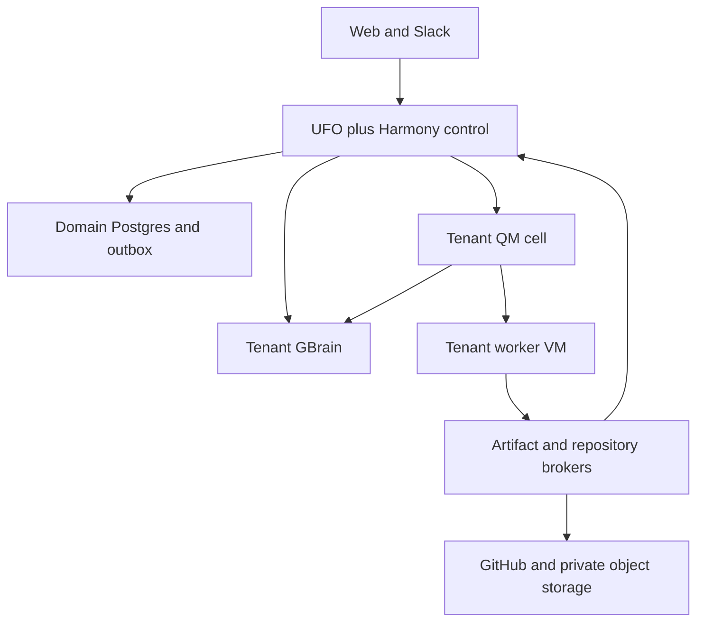

# 03 · System architecture

## 1. Component model

Harmony is one product implemented by a shared control tier and isolated tenant execution cells. UFO, QM, and GBrain remain independently buildable services with a common release manifest. Their native user interfaces are optional operator tools; the customer sees one authenticated product and one Slack application.

The UFO fork contains a first-party, reviewed Harmony extension. That extension owns company onboarding, business schedules, candidate lifecycle, review actions, the domain API, and delegation to QM. It uses UFO's runtime for agent turns and delivery, while explicit Harmony tables govern business transactions. Long-lived human review is represented as database state, not as a model call or a worker held open.

QM runs one organization deployment per tenant in release 1. It owns root manager sessions, specialist sessions, bounded swarm coordination, and the worker execution adapter. GBrain runs with a separate database and service identity per tenant. Neither is exposed directly to customer browsers.

## 2. Logical topology

The arrow from workers to brokers does not imply broad storage or GitHub credentials. Brokers issue task-scoped operations and bounded uploads. All authenticated result ingress is verified before it changes domain state.

## 3. Services and ownership

| Component | Responsibilities | Does not own |
| --- | --- | --- |
| Edge/gateway | TLS, human session validation, rate limiting, request size limits, preview authorization | Candidate decisions, model execution |
| Harmony API in UFO | Membership checks, domain operations, review actions, integrations, task plan admission | QM internal session tables |
| Company agent | Business understanding, questions, opportunity selection recommendations, explanations | Direct state mutation or credential grants |
| Workflow reconciler | Due schedules, outbox dispatch, result reconciliation, leases, approval expiry | Model judgment about feature usefulness |
| Feedback collectors | Authorized fetch, pagination, cursors, normalization, source-health evidence | Company policy publication |
| QM delegation module | Validated assignment admission, manager/worker lifecycle, progress aggregation | Tenant membership or product approval |
| Runner supervisor | Container lifecycle, resources, network policy, lease/fence enforcement | Agent business reasoning |
| Repository broker | Token minting, exact repository access, branch publication, PR operations | Executing arbitrary repo shell commands on the host |
| Artifact broker | Expected uploads, digest verification, immutable manifests, viewer grants | Trusting worker-supplied external URLs |
| GBrain gateway | Actor/task authorization, source mapping, tool-schema adaptation, context snapshots | Workflow success or human approval |
| Notification dispatcher | Idempotent Slack/web notifications from outbox | Independent interpretation of review authority |

Collectors and brokers may be modules of the control service initially. Runner supervision remains a separately deployed process on worker hosts. Repository publication must not share an execution environment with arbitrary application scripts.

## 4. Control and knowledge stores

The shared Postgres deployment contains separate databases/roles for UFO runtime and Harmony domain data. The Harmony schema is owned by a dedicated migration role; runtime connections cannot alter schema. Tenant-owned tables use tenant predicates and row-level security as defense in depth. Authentication tables needed for initial routing are accessed through narrow lookup functions before binding tenant context.

These separate databases do not share a distributed transaction. The Harmony domain transaction commits the command/outbox first; runtime admission uses its stable operation ID. A retried UFO turn looks up the existing command rather than creating another. Runtime delivery/progress is a projection and cannot override domain authority.

Each tenant has a QM database and a GBrain database on the managed Postgres cluster, with distinct credentials. Separate databases do not imply separate hardware; their role boundaries prevent tenant application credentials from reading other tenant databases. The operator provisioning role is isolated from request-handling code.

Raw payloads, source snapshots, recordings, build bundles, result manifests, and exported knowledge go into private object storage. Git remains authoritative for code. Operational metadata remains in Harmony Postgres. GBrain stores redacted semantic knowledge and citations to ledger records rather than becoming a second copy of all raw data.

## 5. Canonical identity path

The web session or verified Slack installation resolves a human principal and tenant membership. The API checks the requested action against current roles and policy. It persists a command and creates a task grant. An internal issuer signs a short-lived token identifying tenant, task, attempt generation, permitted operation, audience, and expiry.

The QM service resolves its tenant from deployment configuration and checks that it matches the token. It rejects any mismatched request body assertion. Each child receives a narrowed grant; worker role text has no effect on authorization. GBrain and artifact access use independently narrowed capabilities. Tenant IDs in logs and payloads support correlation but are never sufficient authentication.

The tenant directory maps our tenant ID to UFO workspace ID, QM deployment/scope ID, GBrain endpoint/database identity, worker pool, and artifact prefix. Only provisioning code can modify these bindings. A broken binding places the tenant in degraded state and stops new execution.

## 6. Representative paths

### 6.1 New feedback

The due-work scanner claims a source poll under a lease. Collector pages are normalized into feedback items and immutable revisions. The final cursor and an analysis event are committed with the successful batch. An outbox worker requests a bounded analysis task. Its result is checked against source/evidence IDs, recorded, and made available to the company agent. Automatic preview selection is a policy transaction, not a free-form model tool call.

### 6.2 Candidate execution

The company agent proposes a candidate through a typed tool. The API validates evidence, product scope, budget, and active-candidate quota. A workflow plan is instantiated from the registered template. The manager receives a QM assignment with a context manifest and task dependencies. Workers run on the tenant worker VM in separate containers with separate workspaces. Their outputs are published as artifacts, checked, and attached to the candidate revision.

The manager's narrative progress is useful but not authoritative. Required task receipts and verification results are authoritative. The root may recommend changing a plan; the workflow service validates and versions that change.

### 6.3 Human review

A verified artifact package creates a review request. Notification delivery is asynchronous and retriable. A reviewer action resolves its opaque review-request ID to the stored revision and checks current roles, expiry, and package digest. The transaction records the decision, advances the phase, and enqueues the next stage. If the notification is duplicated or an old button is clicked, the action returns the original result or a stale-review error without creating work.

### 6.4 Correction and learning

A human correction is stored as a proposed company decision with scope and provenance. If the actor has publication authority and explicitly confirms the decision, the publication worker writes the approved GBrain page, verifies the returned revision, and updates the publication ledger. Fresh task admission includes the current company-knowledge epoch. Existing candidates are checked for affected constraints and either continue under an unaffected snapshot or require revision.

## 7. Business scheduling

One workflow scanner in the UFO tier owns recurring business work. Multiple replicas compete using database leases; they do not run separate independent schedules. The scanner wakes every 15 seconds and admits due source polls, competitor refreshes, approval-expiry checks, and reconciliation tasks. Each schedule occurrence has a stable key: tenant + schedule ID + scheduled UTC instant.

QM may use native mechanisms for bounded execution, and GBrain may use maintenance jobs for indexing. Neither schedules a second copy of customer feedback monitoring. Domain schedulers stop when tenant status is suspended or deleting. Worker polling continues only for cleanup and reconciliation.

## 8. Consistency and failure domains

The domain database is strongly consistent for transitions, approvals, grants, and budgets. Search projections, progress streams, Slack messages, and analytics are eventually consistent. A transition never waits for Slack delivery. It may wait for a verified GBrain context read when required knowledge is unavailable.

Outbox publication and consumer inbox records provide at-least-once delivery. Each side effect has reconciliation metadata. A timeout during a GitHub PR create marks the operation unknown and triggers lookup by branch and operation marker before another create. A task result arriving after revision supersession is recorded but cannot advance the active workflow.

An unavailable tenant GBrain blocks knowledge-dependent task admission for that tenant. It must not silently substitute another brain or empty context. An unavailable QM cell queues that tenant's work. Unrelated tenants continue. A shared database outage blocks durable mutation; the service does not run unrecorded work in memory.

## 9. Integration contract boundaries

The shared contracts repository defines JSON schemas and protocol fixtures. Python and TypeScript clients validate the same schema versions. Services publish a capability endpoint with supported contract majors, health, build SHA, and relevant adapters. Release compatibility is established by the integration test suite and recorded source pins.

No API lets an agent supply a raw database URL, arbitrary model-provider key, unverified callback URL, or another tenant's endpoint. Callbacks are configured destinations in the tenant directory. URLs in evidence are fetch targets subject to the research proxy policy, not callback configuration.

## 10. Scaling and extension

The first qualification target is 20 active tenants with at most four active worker containers each, subject to a global cap of 20 concurrent attempts. Admission uses round-robin tenant fairness and reserves slots before provisioning. Idle tenant worker VMs can stop after artifact/checkpoint persistence; restart delays are surfaced as capacity state.

The tenant cell is an intentional early cost and operational tradeoff. Consolidating QM processes or worker hosts is a later architecture change requiring isolation proofs, not a prompt configuration change. Additional source connectors and application stacks plug into conformance interfaces. A future Superset executor can implement the same task-result contract without changing candidate or approval identity.
