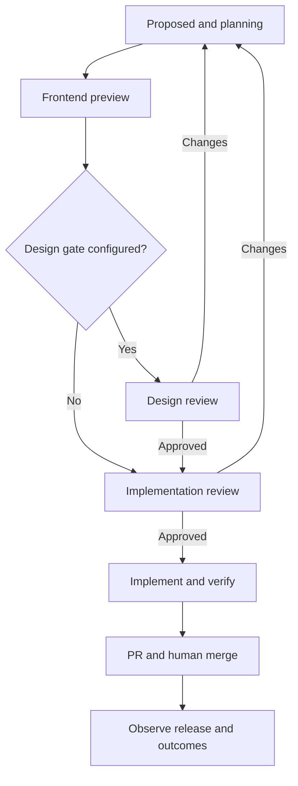

# 07 · Workflows, state machines, and recovery

## 1. Workflow authority

The Harmony workflow service owns candidate phases and task dependencies. Agents propose work and interpret evidence; deterministic code admits plans, checks grants, advances phases, and verifies results. Workflow state is persisted before external work is launched. Waiting for a human or a provider does not require a live model turn.

A candidate has both phase and execution_status. Phase identifies the product stage. execution_status is active, paused, blocked, or terminal. A task failure usually blocks the current phase with a reason and a recoverable checkpoint; it does not collapse the candidate into an ambiguous generic failed state.

## 2. Candidate phase vocabulary

Canonical phases are proposed, planning, preview_building, awaiting_design_review, awaiting_implementation_review, implementing, verifying, pr_open, merged, released, measuring, completed, rejected, and cancelled. Terminal phases are completed, rejected, and cancelled. A candidate may be paused or blocked in any nonterminal phase. Deferred review means paused at the current review phase.

The picture groups states for readability. The transition table below is authoritative. Revision loops are new acyclic plans; the persisted task graph itself never contains a cycle.

## 3. Legal transitions

| From | Trigger / required evidence | To | Side effects |
| --- | --- | --- | --- |
| proposed | Product/repository/evidence admission passes | planning | Create feature source, context snapshot, plan |
| planning | PM spec, repository assessment and AC verified | preview_building | Admit frontend preview tasks |
| preview_building | Build/scenario/package verified; design gate enabled | awaiting_design_review | Create design review request |
| preview_building | Same; no design gate | awaiting_implementation_review | Create implementation review request |
| awaiting_design_review | Authorized design approval of current package | awaiting_implementation_review | Create product review request for same package |
| either review phase | Authorized request_changes | planning | Increment revision, supersede package and pending tasks |
| either review phase | Authorized reject | rejected | Cancel remaining tasks, record reason |
| either review phase | Authorized defer | same phase, paused | Persist resume policy; no new execution |
| awaiting_implementation_review | All current gates approved and budget reserved | implementing | Admit full implementation plan |
| implementing | Implementation tasks return verified code/check receipts | verifying | Admit independent QA and review |
| verifying | QA/reviewer/production checks pass on exact head | pr_open | Publish or update PR idempotently |
| verifying | Technical failure without changed product behavior | implementing | Bounded fix attempt on same approved scope |
| implementing or verifying | Material behavior/scope/mock assumption change | planning | New revision and fresh preview/review |
| pr_open | Trusted PR-change request within approved scope | implementing | Fix and reverify; retain PR identity |
| pr_open | Trusted human GitHub merge observation | merged | Record exact merge SHA |
| merged | Trusted deployment observation for merge lineage | released | Start outcome window |
| released | Outcome observer configured | measuring | Collect observations without claiming causality |
| released | No outcome integration configured | completed | State completion reason explicitly |
| measuring | Observation window ends and report verified | completed | Publish outcome summary |
| any nonterminal | Authorized cancellation | cancelled | Fence work and schedule cleanup |

A closed-unmerged PR blocks pr_open with reason PR_CLOSED. An approver may cancel the candidate or request reopening. An external merge that occurred without Harmony's verification is recorded as an external observation and flagged; the system must not falsely state that its gates passed. Release-1 policy never makes an agent perform the merge.

## 4. Registered plan templates

Company bootstrap: website research -> profile review -> company publication -> source/repository setup validation. Parallel public research tasks may run, but private connectors require explicit authorization.

Discovery: collect -> validate -> cluster -> company-context lookup -> opportunity analysis -> policy selection. Collection is code, analysis can use agents, and selection admission is transactional.

Preview: repository assessment and PM specification -> frontend change -> build -> scenario verification -> optional video composition -> package sealing -> human review. Repository assessment and source research can run concurrently. Video composition waits for verified capture.

Implementation: approved-package validation -> implementation -> tests and independent review -> integration verification -> PR publication. Backend/frontend tasks may run concurrently only on declared disjoint workspaces and integrate through a controlled branch step. One task is the final branch writer.

Knowledge publication: proposal -> authority check -> GBrain write -> retrieval verification -> epoch increment -> impacted-work scan. Publication cannot be reported complete from a write request alone.

## 5. DAG validation

A plan contains registered node types, explicit dependencies, immutable input references, role grants, budgets, deadlines, and result schemas. Validate acyclicity, node count <= 32 per plan, depth <= 8, allowed role transitions, tenant equality, referenced artifacts, repository restrictions, and total reserved budget before admission. These are Harmony limits independent of upstream swarm limits.

Only ready nodes whose dependencies succeeded may start. A skipped optional node must have an explicit policy reason; it cannot masquerade as success. Human gates are durable conditions, not agent task nodes with unlimited timeouts. Plan modifications create a new plan version and identify reused immutable outputs whose inputs are unchanged.

Any agent-proposed task type or tool not in the registry is rejected. The principal manager may ask for a capability change, but cannot grant it. A long plan can be split into bounded stages with new QM swarms; the domain workflow ID remains stable.

## 6. Task lifecycle

Task states are queued, admitting, running, result_received, verifying, succeeded, blocked, failed, cancellation_requested, cancelled, and superseded. queued -> admitting reserves budget and generation. Provider acceptance moves to running once actual execution starts. A result first moves to result_received and then verifying. Only a deterministic verifier moves to succeeded.

An admission timeout with uncertain provider state becomes blocked/UPSTREAM_UNKNOWN and triggers reconciliation. A failed attempt may return the task to queued with a higher generation after the old attempt is fenced. Superseded tasks never return to running. A result that arrives after supersession is retained as diagnostic data only.

The runner sends a heartbeat every 15 seconds and holds a 60-second lease. Broker operations recheck the current generation. On loss, the supervisor prevents further writes and stops the container. A new attempt is not created until the prior writer is confirmed stopped or cannot access write capabilities. Reads may remain possible for cleanup, but no publication is allowed.

## 7. Retry and escalation policy

| Failure | Automatic response | Limit / escalation |
| --- | --- | --- |
| Transient HTTP/read failure | Backoff and same operation key | Five transport tries, then reconcile |
| Worker VM/container provision failure | Retry allocation after cleanup | Two new attempts, then blocked |
| Agent malformed structured result | One repair turn using validation errors | Then CONTRACT_INVALID blocked |
| Code/test failure in allowed scope | Manager assigns bounded correction | Two repair attempts before human escalation |
| Preview/video technical failure | Reuse immutable inputs and rerun failed stage | Two attempts, then blocked |
| Missing company knowledge | Ask a focused question or retrieve allowed sources | No invented fact or silent fallback |
| Authentication revoked | Cancel affected active work | Human reconnect required |
| Budget exhausted | Pause before further paid action | Owner may increase cap through policy API |
| Reviewer requests revisions | Create new candidate revision | Three cycles then explicit scope review |

Retries do not reset spent budget or erase failed reservations. A human retry may authorize another attempt under a new recorded limit but cannot resurrect a stale approval or revoked credential.

## 8. Human review semantics

A package is reviewable only when the required artifacts are verified and accessible to the reviewer. A package has a seven-day default expiry. Design and implementation gates refer to the same package hash. Product approval checks any required design approval. A configuration change adding a new required gate invalidates admission based on older incomplete policy.

First valid terminal decision wins for a review request under row locking. An identical replay returns the original result. A competing different decision receives ALREADY_DECIDED and current state. Requesting changes after approval is a new revision command, not overwriting the approval record.

Before implementation admission, recheck current reviewer membership/role and current policy. Revocation before admission invalidates the authority to start new work. Once implementation has begun, an owner revocation or emergency stop cancels work through normal control paths; membership changes are audited and do not rewrite historical approval.

Approval expiry before implementation starts requires re-review. A valid admitted implementation may continue after the package's viewing expiry, using retained immutable evidence. However, material changes or a new implementation admission after a cancelled run require current authorization. Expiring preview runtime is different from expiring review evidence: the same immutable build can be restarted without changing package identity if all hashes and behavior inputs remain identical.

## 9. Material change classification

Material changes include new user-visible behavior, altered permissions or data exposure, changed acceptance criteria, replacement of a mock with a materially different product interaction, new destructive action, or a dependency change that changes the approved experience. They require a new revision and review.

Internal refactoring, additional tests, performance work preserving accepted behavior, and implementation of the disclosed backend contract can remain within the approved revision. The manager proposes this classification and an independent reviewer verifies it. Uncertainty resolves to re-review. No model may waive the human gate for convenience.

## 10. Concurrency and code conflicts

At most two candidates per product may be active. Each candidate has its own branch/workspaces. Tasks declaring overlapping write paths or shared database schema changes are serialized by a repository integration lease. A final integrator applies patches in a deterministic order and reruns tests. It never combines unreviewed candidate scopes into one approved package.

Target-branch movement is detected before preview sealing, before final verification, and before PR publication. Rebase/merge conflict resolution that affects approved behavior creates a new revision. If a patch can be reapplied without behavior changes, run the affected scenario and record the new head plus equivalence evidence; the independent reviewer must accept it before PR update. Old recordings remain labeled with their old build.

## 11. Cancellation, pause, and cleanup

Pause prevents new paid work and requests checkpointing of active tasks. It does not guarantee arbitrary application processes can checkpoint; stop them after the grace period and persist available artifacts. Resume reevaluates policy, grants, context freshness, and approval state.

Cancellation is terminal for that candidate. It fences tasks, revokes preview access, stops containers, and cleans temporary resources. Existing PRs are not silently deleted; the service posts a cancellation status and may close its own unmerged PR only if the user explicitly requested closure or the configured cancellation policy permits it. Git branches and artifact retention follow recorded cleanup policy.

Cancel vs completion is decided by the committed domain transaction and generation check. If completion committed first, cancellation stops downstream work; it does not erase the result. If cancellation committed first, late completion cannot advance state.

## 12. Recovery and reconciliation

On startup, scan admitting/running tasks with expired leases, unknown external operations, undelivered outbox rows, pending knowledge publications, and abandoned expected uploads. Reconcile provider state before restarting effects. Root and worker agents are replaceable: current assignment state, context manifest, artifacts, and receipts must be sufficient to resume a fresh session.

A recovery drill must kill UFO after domain commit but before dispatch, kill QM after provider acceptance but before acknowledgement, duplicate completion events, and restart during review wait. Each drill must preserve one logical assignment and one PR while producing an audit explanation of recovery.
